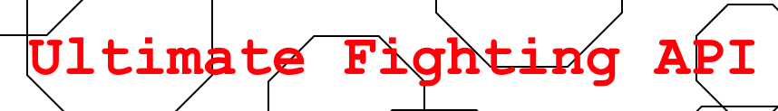

<h1 align="center">
  <a href="https://github.com/jmurillo07/Ultimate-fighting-API">
    <!-- Please provide path to your logo here -->
    
  </a>
</h1>

<div align="center">
  Ultimate Fighting Api — Stats and Community
  <br />
  <br />
  <a href="https://github.com/jmurillo07/Ultimate-fighting-API/issues/new?assignees=&labels=bug&template=01_BUG_REPORT.md&title=bug%3A+">Report a Bug</a>
  ·
  <a href="https://github.com/jmurillo07/Ultimate-fighting-API/issues/new?assignees=&labels=enhancement&template=02_FEATURE_REQUEST.md&title=feat%3A+">Request a Feature</a>
</div>

<div align="center">
<br />

[](https://github.com/jmurillo07/Ultimate-fighting-API/issues?q=is%3Aissue+is%3Aopen+label%3A%22help+wanted%22)
[%20by-K%26J%26L-ff1414.svg?style=flat-square)](https://github.com/kafu24)

</div>

<details open="open">
<summary>Table of Contents</summary>

- [About](#about)
  - [Built With](#built-with)
- [Getting Started](#getting-started)
  - [Prerequisites](#prerequisites)
  - [Installation](#installation)
- [Usage](#usage)
- [Roadmap](#roadmap)
- [Authors & contributors](#authors--contributors)
- [Security](#security)
- [Acknowledgements](#acknowledgements)

</details>

---

## About

<table>
<tr>
<td>

This API is meant to serve an application extracting information on UFC fighter and event data. The UFC (ultimate fighting championship) is the premier mixed martial arts competition in the world that hosts events throughout the year on a near weekly basis. Additionally, it has support for users and community predictions, storing the predictions users have on certain fights on who would win.

</td>
</tr>
</table>

### Built With

 - [Vercel](https://vercel.com/)
 - [Supabase](https://supabase.com/)
 - [FastAPI](https://fastapi.tiangolo.com/lo/)

## Getting Started

### Prerequisites

 - fastapi==0.88.0
 - pytest==7.1.3
 - uvicorn==0.20.0
 - sqlalchemy==2.0.7
 - psycopg2-binary~=2.9.3

### Installation

After cloning the repository, create a `.env` file where you will then fill out the below with your own values. This will allow the engine to connect to your database.
```
POSTGRES_DB="postgres"
POSTGRES_SERVER="localhost"
POSTGRES_PASSWORD="postgres"
POSTGRES_USER="postgres"
POSTGRES_PORT="54322"
```

If desired, one can run `converter.py` to populate their database with real data (`ufc_event_data.csv`, `ufc_fighters.csv`) or `src/post_fake_data.py` to populate it with fake data.

## Usage

### Usage

We have a production API being hosted on Vercel here: 

 - [Production](https://csc-365-project-rosy.vercel.app/)

If you would like to create your own server, you would need to adjust your environment variables for your database appropriately.

Starting up a local server then becomes as easy as:
```sh
python main.py
```

## Roadmap

See the [open issues](https://github.com/jmurillo07/Ultimate-fighting-API/issues) for a list of proposed features (and known issues).

- [Top Feature Requests](https://github.com/jmurillo07/Ultimate-fighting-API/issues?q=label%3Aenhancement+is%3Aopen+sort%3Areactions-%2B1-desc) (Add your votes using the 👍 reaction)
- [Top Bugs](https://github.com/jmurillo07/Ultimate-fighting-API/issues?q=is%3Aissue+is%3Aopen+label%3Abug+sort%3Areactions-%2B1-desc) (Add your votes using the 👍 reaction)
- [Newest Bugs](https://github.com/jmurillo07/Ultimate-fighting-API/issues?q=is%3Aopen+is%3Aissue+label%3Abug)


## Authors & contributors

For a full list of all authors and contributors, see [the contributors page](https://github.com/jmurillo07/Ultimate-fighting-API/contributors).

## Security

Ultimate-fighting-API follows good practices of security, but 100% security cannot be assured.
Ultimate-fighting-API is provided **"as is"** without any **warranty**. Use at your own risk.

_For more information and to report security issues, please refer to our [security documentation](docs/SECURITY.md)._


## Acknowledgements

Huge gratitude towards https://github.com/jackalnom/movie_api for providing us with a template we heavily relied on.

The `.csv` files were taken from https://www.kaggle.com/datasets/fatismajli/ufc-data?select=ufc_event_data.csv.

Additionally, https://github.com/jackalnom/fake_post_data was referenced to aid in the creation of our fake data populator.